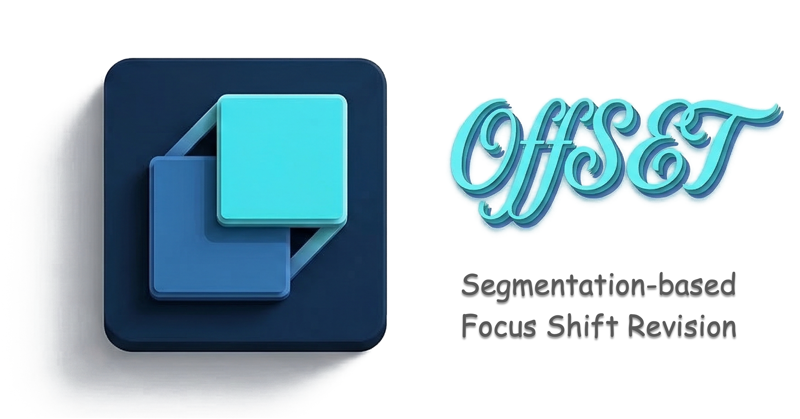








Hi, I am Zhiwei Chen (陈智伟).
=====
I'm currently a Master student in the [School of Software](https://www.sc.sdu.edu.cn), [Shandong University](https://www.sdu.edu.cn), under the supervision of Prof. [Liqiang Nie](https://liqiangnie.github.io/index.html) and Prof. [Yupeng Hu](https://faculty.sdu.edu.cn/huyupeng1/zh_CN/index.htm). 

My research interests include *multimedia computing, information retrieval, and approximate nearest neighbor search*.

> 🏝️ *I am a strong advocate for open science. All the team projects I have been primarily involved in have been fully open-sourced. We warmly invite you to explore our projects, share your feedback, and connect with us for further discussion.*

#  Our open source projects
This is our repository. We invite everyone to follow and support the project. Thank you for your attention! 🥰
 
<table style="width:100%; border:none; text-align:center; background-color:transparent;">
  <tr style="border:none;">
    <td style="width:30%; border:none; vertical-align:top; padding-top:30px;">
       
      <b>AAAI 2026</b> 
      
        <!-- <a href="" target="_blank">Web</a> |  -->
        <a href="https://github.com/ZivChen-Ty/INTENT" target="_blank">Code</a> | 
        <a href="https://ojs.aaai.org/index.php/AAAI/article/view/39181" target="_blank">Paper</a>
      
    </td>  
    <td style="width:30%; border:none; vertical-align:top; padding-top:30px;">
       
      <b>AAAI 2026</b> 
      
        <!-- <a href="" target="_blank">Web</a> |  -->
        <a href="https://github.com/Lee-zixu/HABIT" target="_blank">Code</a> | 
        <a href="https://ojs.aaai.org/index.php/AAAI/article/view/37608" target="_blank">Paper</a>
      
    </td>
    <td style="width:30%; border:none; vertical-align:top; padding-top:30px;">
       
      <b>AAAI 2026</b> 
      
        <!-- <a href="" target="_blank">Web</a> |  -->
        <a href="https://github.com/Lee-zixu/ReTrack" target="_blank">Code</a> | 
        <a href="https://ojs.aaai.org/index.php/AAAI/article/view/39507" target="_blank">Paper</a>
      
    </td>
    </tr>
  <tr style="border:none;">
    <td style="width:30%; border:none; vertical-align:top; padding-top:30px;">
       
      <b>ACM MM 2025</b> 
      
        <a href="https://zivchen-ty.github.io/HUD.github.io/" target="_blank">Web</a> | 
        <a href="https://github.com/ZivChen-Ty/HUD" target="_blank">Code</a> | 
        <a href="https://dl.acm.org/doi/10.1145/3746027.3755445" target="_blank">Paper</a>
      
    </td>
    <td style="width:30%; border:none; vertical-align:top; padding-top:30px;">
       
      <b>ACM MM 2025</b> 
      
        <a href="https://zivchen-ty.github.io/OFFSET.github.io/" target="_blank">Web</a> | 
        <a href="https://github.com/ZivChen-Ty/OFFSET" target="_blank">Code</a> | 
        <a href="https://dl.acm.org/doi/10.1145/3746027.3755366" target="_blank">Paper</a>
      
    </td>
    <td style="width:30%; border:none; vertical-align:top; padding-top:30px;">
       
      <b>AAAI 2025</b> 
      
        <a href="https://sdu-l.github.io/ENCODER.github.io/" target="_blank">Web</a> | 
        <a href="https://github.com/Lee-zixu/ENCODER" target="_blank">Code</a> | 
        <a href="https://ojs.aaai.org/index.php/AAAI/article/view/32541" target="_blank">Paper</a>
      
    </td>
  </tr>
</table>

# 🔥 News
- *2026.03.17*: &nbsp;🎉🎉 One paper (STABLE), was accepted by **TKDE 2026**! Congratulations to all co-authors!
- *2026.02.21*: &nbsp;🎉🎉 Two papers (ConeSep, Air-Know), were accepted by **CVPR 2026**! Congratulations to all co-authors!
- *2025.11.08*: &nbsp;🎉🎉 Three papers were accepted by **AAAI 2026**! Thanks and Congratulations to all co-authors!
- *2025.10.18*: &nbsp;🎉🎉 As the core member, our team wins the **Grand Prize** in the CICAS Smart Power Scenario Competition. Congratulations to all team members!
- *2025.07.05*: &nbsp;🎉🎉 Two paper have been accepted by **ACM MM 2025**! Thanks to our co-authors!
- *2024.12.10*: &nbsp;🎉🎉 One paper has been accepted by **AAAI 2025**! Congratulations to our co-authors!
- *2024.09.13*: &nbsp;🎉🎉 I was honored to receive the **Huawei Outstanding Technical Collaboration Award (Top 10 globally per year)**.

# 📝 Selected Publications [[Full Publications Here]](/publications/)

TKDE 2026

**STABLE: Efficient Hybrid Nearest Neighbor Search via Magnitude-Uniformity and Cardinality-Robustness** [*Coming Soon*]

Qianyun Yang, [***Zhiwei Chen***](https://zivchen-ty.github.io/), [Yupeng Hu](https://faculty.sdu.edu.cn/huyupeng1/zh_CN/index.htm), [Zixu Li](https://lee-zixu.github.io),  [Zhiheng Fu](https://zhihfu.github.io), [Liqiang Nie](https://liqiangnie.github.io/index.html)

CVPR 2026

**ConeSep: Cone-based Robust Noise-Unlearning Compositional Network for Composed Image Retrieval** [*Coming Soon*]

[Zixu Li](https://lee-zixu.github.io), [Yupeng Hu](https://faculty.sdu.edu.cn/huyupeng1/zh_CN/index.htm), [***Zhiwei Chen***](https://zivchen-ty.github.io/), Mingyu Zhang, [Zhiheng Fu](https://zhihfu.github.io), [Liqiang Nie](https://liqiangnie.github.io/index.html)

CVPR 2026

**Air-Know: Arbiter-Calibrated Knowledge-Internalizing Robust Network for Composed Image Retrieval** [*Coming Soon*]

[Zhiheng Fu](https://zhihfu.github.io), [Yupeng Hu](https://faculty.sdu.edu.cn/huyupeng1/zh_CN/index.htm), Qianyun Yang, Shiqi Zhang, [***Zhiwei Chen***](https://zivchen-ty.github.io/), [Zixu Li](https://lee-zixu.github.io)

AAAI 2026

**INTENT: Invariance and Discrimination-aware Noise Mitigation for Robust Composed Image Retrieval** [[PDF]](https://ojs.aaai.org/index.php/AAAI/article/view/39181) [[Code]](https://github.com/ZivChen-Ty/INTENT)

[***Zhiwei Chen***](https://zivchen-ty.github.io/), [Yupeng Hu](https://faculty.sdu.edu.cn/huyupeng1/zh_CN/index.htm), [Zhiheng Fu](https://zhihfu.github.io),[Zixu Li](https://lee-zixu.github.io), Jiale Huang, [Qinlei Huang](https://windlikeo.github.io/HQL.github.io/), [Yinwei Wei](https://weiyinwei.github.io)

<!-- 

AAAI 2026

**ReTrack: Evidence-Driven Dual-Stream Directional Anchor Calibration Network for Composed Video Retrieval** [*Coming Soon*]

[Zixu Li](https://lee-zixu.github.io), [Yupeng Hu](https://faculty.sdu.edu.cn/huyupeng1/zh_CN/index.htm), [***Zhiwei Chen***](https://zivchen-ty.github.io/), [Qinlei Huang](https://windlikeo.github.io/HQL.github.io/), Guozhi Qiu, [Zhiheng Fu](https://zhihfu.github.io), [Meng Liu](https://mengliu1991.github.io)

AAAI 2026

**HABIT: Chrono-Synergia Robust Progressive Learning Framework for Composed Image Retrieval** [*Coming Soon*]

[Zixu Li](https://lee-zixu.github.io), [Yupeng Hu](https://faculty.sdu.edu.cn/huyupeng1/zh_CN/index.htm), [***Zhiwei Chen***](https://zivchen-ty.github.io/), Shiqi Zhang, [Qinlei Huang](https://windlikeo.github.io/HQL.github.io/), [Zhiheng Fu](https://zhihfu.github.io), [Yinwei Wei](https://weiyinwei.github.io)

 -->

ACM MM 2025

**OFFSET: Segmentation-based Focus Shift Revision for Composed Image Retrieval** [[PDF]](https://dl.acm.org/doi/10.1145/3746027.3755366) [[Website]](https://zivchen-ty.github.io/OFFSET.github.io/) [[Code]](https://github.com/ZivChen-Ty/OFFSET)

[***Zhiwei Chen***](https://zivchen-ty.github.io/), [Yupeng Hu](https://faculty.sdu.edu.cn/huyupeng1/zh_CN/index.htm), [Zixu Li](https://lee-zixu.github.io),  [Zhiheng Fu](https://zhihfu.github.io),  [Xuemeng Song](https://xuemengsong.github.io/), [Liqiang Nie](https://liqiangnie.github.io/index.html)

ACM MM 2025

**HUD: Hierarchical Uncertainty-Aware Disambiguation Network for Composed Video Retrieval** [[PDF]](https://dl.acm.org/doi/10.1145/3746027.3755445) [[Website]](https://zivchen-ty.github.io/HUD.github.io/) [[Code]](https://github.com/ZivChen-Ty/HUD)

[***Zhiwei Chen***](https://zivchen-ty.github.io/), [Yupeng Hu](https://faculty.sdu.edu.cn/huyupeng1/zh_CN/index.htm), [Zixu Li](https://lee-zixu.github.io),  [Zhiheng Fu](https://zhihfu.github.io),  [Haokun Wen](https://haokunwen.github.io/), [Weili Guan](https://faculty.hitsz.edu.cn/guanweili)

<!-- 

AAAI 2025

**ENCODER: Entity Mining and Modification Relation Binding for Composed Image Retrieval** [[PDF]](https://ojs.aaai.org/index.php/AAAI/article/view/32541) [[Website]](https://sdu-l.github.io/ENCODER.github.io/) [[Code]](https://drive.google.com/drive/u/2/folders/1QuBQVIybLwn-qFSORhpBsnXy6ebhtNr3?usp=sharing) 

[Zixu Li](https://lee-zixu.github.io), [***Zhiwei Chen***](https://zivchen-ty.github.io/), [Haokun Wen](https://haokunwen.github.io/), [Zhiheng Fu](https://zhihfu.github.io), [Yupeng Hu](https://faculty.sdu.edu.cn/huyupeng1/zh_CN/index.htm), [Weili Guan](https://faculty.hitsz.edu.cn/guanweili)

 -->

# 🔖 Patent 
- (已授权)一种基于类社交先验的多模态语义表征方法及系统 - 公开号: *CN118194109A* - [[详情]](https://www.baiten.cn/patent/detail/e1407de3ec9711ac14edbf80a87f834d757f2e9a0fdcca47?sc=&fq=&type=&sort=&sortField=&q=陈智伟+山东大学&rows=10#1/CN202410235890.8/detail/abst)

- 基于特征相似性和属性一致性协同约束的近似近邻混合检索的用户推荐方法及系统 - 公开号: *CN117453991A* - [[详情]](https://www.baiten.cn/patent/detail/e1407de3ec9711ac14edbf80a87f834d757f2e9a0fdcca47?sc=&fq=&type=&sort=&sortField=&q=陈智伟+山东大学&rows=10#1/CN202311201790.5/detail/abst)

- 基于实体挖掘和修改关系绑定的组合图像检索方法及系统 - 公开号: *CN120067365A* - [[详情]](https://www.baiten.cn/patent/detail/e1407de3ec9711ac14edbf80a87f834d757f2e9a0fdcca47?sc=&fq=&type=&sort=&sortField=&q=陈智伟+山东大学&rows=10#1/CN202411903224.3/detail/abst)

- 基于自适应中间粒度聚合网络的组合图像检索方法及系统 - 公开号: *CN120104822A* - [[详情]](https://www.baiten.cn/patent/detail/e1407de3ec9711ac14edbf80a87f834d757f2e9a0fdcca47?sc=&fq=&type=&sort=&sortField=&q=陈智伟+山东大学&rows=10#1/CN202510274983.6/detail/abst)

- 一种基于分割焦点偏移修正的组合图像检索方法及系统 - 公开号: *CN120144812A* - [[详情]](https://www.baiten.cn/patent/detail/e1407de3ec9711ac14edbf80a87f834d757f2e9a0fdcca47?sc=&fq=&type=&sort=&sortField=&q=陈智伟+山东大学&rows=10#1/CN202510143920.7/detail/abst)

- 基于互补性引导解耦的组合图像检索方法及系统 - 公开号: *CN120144811A* - [[详情]](https://www.baiten.cn/patent/detail/e1407de3ec9711ac14edbf80a87f834d757f2e9a0fdcca47?sc=&fq=&type=&sort=&sortField=&q=陈智伟+山东大学&rows=10#1/CN202510142418.4/detail/abst)

# 🎖 Honors and Awards
- *2025.10*: **Grand Prize** in the CICAS Smart Power Scenario Competition
- *2024.09*: Huawei Outstanding Technical Collaboration Award (***Top 10 globally per year***)
- *2024.06*: Recipient of the Outstanding Graduate Award, Shandong University

# 📖 Educations
- *2024.09 - now*, Master in the School of Software, Shandong University. 
- *2020.09 - 2024.08*, Bachelor in the School of Software, Shandong University. 

# 📃 Services
- Conference PC Member: AAAI, CIKM
- Journal Reviewer: Information Sciences

 
 
 
 
 
 
 
 
 
 
