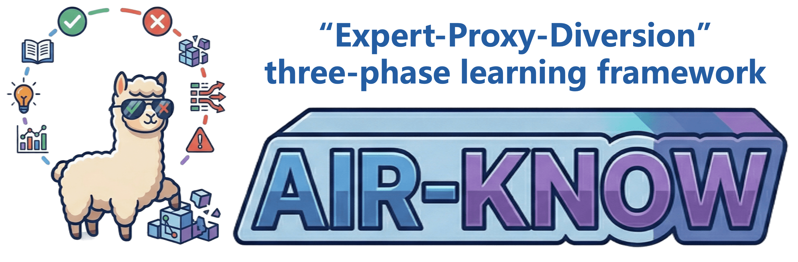
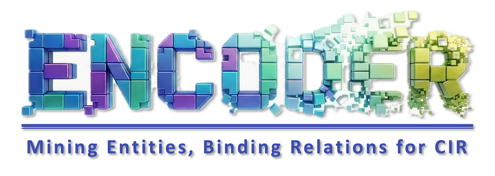

 







Hi, I am Zhiwei Chen (陈智伟).
=====

  

    <button class="lang-tab active" type="button" data-lang="en" role="tab" aria-selected="true">English</button>
    <button class="lang-tab" type="button" data-lang="zh" role="tab" aria-selected="false">中文</button>
  

  

    

      
Welcome to my homepage! I am currently a Ph.D. student in the <a href="https://www.sc.sdu.edu.cn">School of Software</a>, <a href="https://www.sdu.edu.cn">Shandong University</a>, under the supervision of Prof. <a href="https://liqiangnie.github.io/index.html">Liqiang Nie</a> and Prof. <a href="https://faculty.sdu.edu.cn/huyupeng1/zh_CN/index.htm">Yupeng Hu</a>, working closely with Dr. <a href="https://lee-zixu.github.io">Zixu Li</a>. My research interests mainly focus on <strong>multimodal understanding, robust cross-modal learning, trustworthy evaluation, and approximate nearest neighbor search</strong>.

      
My research follows the trajectory of <strong>from multimodal understanding to evidence-driven large model evaluation</strong>. On the model side, I study fine-grained visual-textual semantic fusion, composed image/video understanding, attribute-aware representation learning, and robust intent disentanglement, with representative works including <strong>COMBINER</strong>, <strong>STABLE</strong>, <strong>ConeSep</strong>, <strong>Air-Know</strong>, <strong>INTENT</strong>, <strong>HABIT</strong>, <strong>HUD</strong>, <strong>OFFSET</strong>, and <strong>ENCODER</strong>. On the evaluation side, I have contributed to long-form video and egocentric vision reasoning systems, including the CVPRW challenge technical reports <strong>R3</strong>, <strong>TempRet</strong>, <strong>EgoAdapt</strong>, <strong>OmniEgo-R2</strong>, and <strong>EgoAction</strong>.

      
Beyond publications, I actively participate in open-source research and industry-scale systems. As a core member of the Huawei collaboration project on general-purpose vector search, I contributed to the QSGNGT graph-indexing algorithm and its optimization for high-throughput vector search. The project has continuously ranked first worldwide on ANN-Benchmarks since 2023 and supports Huawei Cloud GaussDB / CSS VectorDB. I have been recognized with the <strong>Huawei Outstanding Technical Collaboration Award</strong>, the <strong>BYD Scholarship</strong>, and the <strong>Grand Prize</strong> in the CICAS Smart Power Scenario Competition.

    

    

      
From Multimodal Understanding to Evidence-driven Large Model Evaluation

      
Representation Optimization and Algorithm Design for Multimodal Understanding

      

        

          
Multimodal Semantic Fusion

          
Designing entity-attribute-relation alignment algorithms to optimize cross-modal semantic interaction structures.

          
<a class="node-paper-link" href="#paper-encoder">ENCODER [AAAI 2025]</a><a class="node-paper-link" href="#paper-temp-ret">TempRet [CVPRW 2026]</a>

        

        

          
Complex-scene Intent Feature Disentanglement

          
Developing robust denoising and feature extraction algorithms for complex noise and intent distortion.

          
<a class="node-paper-link" href="#paper-habit">HABIT [AAAI 2026]</a><a class="node-paper-link" href="#paper-intent">INTENT [AAAI 2026]</a><a class="node-paper-link" href="#paper-egoaction">EgoAction [CVPRW 2026]</a>

        

        

          
Attribute-aware Efficient Representation

          
Building lightweight yet accurate representation learning with attribute-neighborhood topology and acceleration strategies.

          
<a class="node-paper-link" href="#paper-combiner">COMBINER [TIP 2026]</a><a class="node-paper-link" href="#paper-stable">STABLE [TKDE 2026]</a><a class="node-paper-link" href="#paper-refine">REFINE [ToMM 2026]</a><a class="node-paper-link" href="#paper-omniego">OmniEgo-R2 [CVPRW 2026]</a>

        

      

      
From Multimodal Understanding to Evidence-Driven Evaluation of Large Models

      

        

          
Evidence-driven Hallucination Diagnosis and Disambiguation

          
Constructing multimodal external evidence chains to evaluate and mitigate model uncertainty and hallucination.

          
<a class="node-paper-link" href="#paper-retrack">ReTrack [AAAI 2026]</a><a class="node-paper-link" href="#paper-hud">HUD [ACM MM 2025]</a><a class="node-paper-link" href="#paper-r3">R3 [CVPRW 2026]</a>

        

        

          
Trustworthy Knowledge Calibration

          
Building noise-separation frameworks for calibrated and trustworthy alignment of large-model outputs.

          
<a class="node-paper-link" href="#paper-conesep">ConeSep [CVPR 2026]</a><a class="node-paper-link" href="#paper-airknow">Air-Know [CVPR 2026]</a><a class="node-paper-link" href="#paper-offset">OFFSET [ACM MM 2025]</a>

        

        

          
Fine-grained Evaluation Benchmark Construction

          
Constructing fine-grained multimodal benchmarks for complex contextual and open-world scenarios.

          
<a class="node-paper-link" href="#paper-tema">TEMA [ACL 2026 Main]</a><a class="node-paper-link" href="#paper-finecir">FineCIR [Preprint]</a><a class="node-paper-link" href="#paper-egoadapt">EgoAdapt [CVPRW 2026]</a>

        

      

      
Diagnostic Frameworks and Benchmark Evaluation for Trustworthy Large Models

    

  

  

    

      
欢迎来到我的主页！我目前是山东大学<a href="https://www.sc.sdu.edu.cn">软件学院</a>博士研究生，师从 Prof. <a href="https://liqiangnie.github.io/index.html">Liqiang Nie</a> 与 Prof. <a href="https://faculty.sdu.edu.cn/huyupeng1/zh_CN/index.htm">Yupeng Hu</a>，并与 Dr. <a href="https://lee-zixu.github.io">Zixu Li</a> 保持紧密合作。我的研究兴趣主要聚焦于<strong>多模态理解、鲁棒跨模态学习、可信评测与近似近邻检索</strong>。

      
我的研究围绕“<strong>从多模态理解到证据驱动的大模型评测</strong>”这一主线展开：一方面，我关注细粒度视觉-语言语义融合、组合式图文/视频理解、属性感知表征学习与复杂场景意图解耦，代表工作包括 <strong>COMBINER</strong>、<strong>STABLE</strong>、<strong>ConeSep</strong>、<strong>Air-Know</strong>、<strong>INTENT</strong>、<strong>HABIT</strong>、<strong>HUD</strong>、<strong>OFFSET</strong> 与 <strong>ENCODER</strong>；另一方面，我参与长视频理解、第一视角视觉推理与多模态评测系统构建，相关技术报告包括 <strong>R3</strong>、<strong>TempRet</strong>、<strong>EgoAdapt</strong>、<strong>OmniEgo-R2</strong> 与 <strong>EgoAction</strong>。

      
除学术论文外，我也积极参与开源研究与产业级系统研发。作为华为通用向量检索合作项目的核心成员，我参与 QSGNGT 图索引算法及其高吞吐向量检索优化；该项目自2023年至今蝉联 ANN-Benchmarks 官方测评世界第一，并支撑华为云 GaussDB / CSS VectorDB 的向量检索能力。相关工作曾获<strong>华为优秀技术合作成果奖</strong>，我也曾获得 <strong>BYD Scholarship</strong> 与 CICAS 智能电力场景竞赛<strong>特等奖</strong>。

    

    

      
从多模态理解到证据驱动的大模型评测

      
面向多模态理解的表征优化与算法设计

      

        

多模态融合语义理解

设计实体-属性-关系对齐算法，优化跨模态语义交互结构。

<a class="node-paper-link" href="#paper-encoder">ENCODER [AAAI 2025]</a><a class="node-paper-link" href="#paper-temp-ret">TempRet [CVPRW 2026]</a>

        

复杂场景意图特征解耦

针对复杂噪声与意图畸变，设计鲁棒的去噪与特征提取算法。

<a class="node-paper-link" href="#paper-habit">HABIT [AAAI 2026]</a><a class="node-paper-link" href="#paper-intent">INTENT [AAAI 2026]</a><a class="node-paper-link" href="#paper-egoaction">EgoAction [CVPRW 2026]</a>

        

属性感知高效表征

基于属性邻域拓扑与加速策略，实现轻量化高精度的表征学习。

<a class="node-paper-link" href="#paper-combiner">COMBINER [TIP 2026]</a><a class="node-paper-link" href="#paper-stable">STABLE [TKDE 2026]</a><a class="node-paper-link" href="#paper-refine">REFINE [ToMM 2026]</a><a class="node-paper-link" href="#paper-omniego">OmniEgo-R2 [CVPRW 2026]</a>

      

      
从多模态理解到证据驱动的大模型评测

      

        

证据驱动的幻觉诊断与消歧

构建多模态外部证据链，评估并消除模型的不确定性与幻觉。

<a class="node-paper-link" href="#paper-retrack">ReTrack [AAAI 2026]</a><a class="node-paper-link" href="#paper-hud">HUD [ACM MM 2025]</a><a class="node-paper-link" href="#paper-r3">R3 [CVPRW 2026]</a>

        

可信知识校准

构建噪声分离框架，实现大模型输出的校准与可信对齐。

<a class="node-paper-link" href="#paper-conesep">ConeSep [CVPR 2026]</a><a class="node-paper-link" href="#paper-airknow">Air-Know [CVPR 2026]</a><a class="node-paper-link" href="#paper-offset">OFFSET [ACM MM 2025]</a>

        

细粒度评测基准构建

针对复杂上下文场景，构建细粒度多模态评测基准。

<a class="node-paper-link" href="#paper-tema">TEMA [ACL 2026 Main]</a><a class="node-paper-link" href="#paper-finecir">FineCIR [Preprint]</a><a class="node-paper-link" href="#paper-egoadapt">EgoAdapt [CVPRW 2026]</a>

      

      
面向可信大模型的诊断框架与基准评测

    

  

<a class="roadmap-back-btn" id="roadmap-back-btn" href="#research-map" aria-label="Back to research roadmap">↩ Back to Roadmap↩ 返回研究路线图</a>

  

 I am affiliated with the Intelligent Media Research Center (iLearn). I believe open-source research makes multimodal learning more reproducible and collaborative. Our lab's projects and papers are open-source; please visit <a href="https://github.com/iLearn-Lab">iLearn Lab</a> and feel free to share your valuable feedback.

  

我隶属于智能媒体研究中心 (iLearn)，并相信开源研究能够提升多模态学习的可复现性与协作性。实验室论文代码与相关项目持续开源，欢迎访问 <a href="https://github.com/iLearn-Lab">iLearn Lab</a> 并提出宝贵意见。

  
💻 Open Science💻 开放科学

  
Our Open Source Projects我们的开源项目

  
Below are representative project pages and repositories from our recent works. Feedback, issues, and pull requests are warmly welcome.

  
以下是我们近期代表性工作的项目主页与代码仓库，欢迎反馈、Issue 与 PR。

  

    

      
      
COMBINER

      
TIP 2026 · Attribute-aware Efficient RepresentationTIP 2026 · 属性感知高效表征

      
<a href="https://ieeexplore.ieee.org/abstract/document/11534406" target="_blank" title="Open COMBINER paper">Paper论文</a><a href="https://lee-zixu.github.io/COMBINER.github.io/" target="_blank" title="Open COMBINER project page">Project项目</a><a href="https://github.com/Lee-zixu/COMBINER" target="_blank" title="Open COMBINER code repository">Code代码</a>

    

    

      
      
TEMA

      
ACL 2026 Main · BenchmarkACL 2026 Main · 评测基准

      
<a href="https://arxiv.org/abs/2604.21806" target="_blank" title="Open TEMA paper">Paper论文</a><a href="https://lee-zixu.github.io/TEMA.github.io/" target="_blank" title="Open TEMA project page">Project项目</a><a href="https://github.com/Lee-zixu/ACL26-TEMA" target="_blank" title="Open TEMA code repository">Code代码</a>

    

    

      
      
ConeSep

      
CVPR 2026 · Robust UnlearningCVPR 2026 · 鲁棒噪声遗忘

      
<a href="https://arxiv.org/abs/2604.20358" target="_blank" title="Open ConeSep paper">Paper论文</a><a href="https://lee-zixu.github.io/ConeSep.github.io/" target="_blank" title="Open ConeSep project page">Project项目</a><a href="https://github.com/Lee-zixu/ConeSep" target="_blank" title="Open ConeSep code repository">Code代码</a>

    

    

      
      
Air-Know

      
CVPR 2026 · Knowledge CalibrationCVPR 2026 · 知识校准

      
<a href="http://arxiv.org/abs/2604.19386" target="_blank" title="Open Air-Know paper">Paper论文</a><a href="https://zhihfu.github.io/Air-Know.github.io/" target="_blank" title="Open Air-Know project page">Project项目</a><a href="https://github.com/ZhihFu/Air-Know" target="_blank" title="Open Air-Know code repository">Code代码</a>

    

    

      
      
HABIT

      
AAAI 2026 · Robust Progressive LearningAAAI 2026 · 鲁棒渐进学习

      
<a href="https://arxiv.org/abs/2604.18037" target="_blank" title="Open HABIT paper">Paper论文</a><a href="https://lee-zixu.github.io/HABIT.github.io/" target="_blank" title="Open HABIT project page">Project项目</a><a href="https://github.com/Lee-zixu/HABIT" target="_blank" title="Open HABIT code repository">Code代码</a>

    

    

      
      
ReTrack

      
AAAI 2026 · Evidence-driven Reliable ReasoningAAAI 2026 · 证据驱动可靠推理

      
<a href="http://arxiv.org/abs/2604.17898" target="_blank" title="Open ReTrack paper">Paper论文</a><a href="https://lee-zixu.github.io/ReTrack.github.io/" target="_blank" title="Open ReTrack project page">Project项目</a><a href="https://github.com/Lee-zixu/ReTrack" target="_blank" title="Open ReTrack code repository">Code代码</a>

    

    

      
      
INTENT

      
AAAI 2026 · Intent DisentanglementAAAI 2026 · 意图解耦

      
<a href="https://arxiv.org/abs/2604.18051" target="_blank" title="Open INTENT paper">Paper论文</a><a href="https://zivchen-ty.github.io/INTENT.github.io/" target="_blank" title="Open INTENT project page">Project项目</a><a href="https://github.com/ZivChen-Ty/INTENT" target="_blank" title="Open INTENT code repository">Code代码</a>

    

    

      
      
HUD

      
ACM MM 2025 · Uncertainty DisambiguationACM MM 2025 · 不确定性消歧

      
<a href="https://arxiv.org/abs/2512.02792" target="_blank" title="Open HUD paper">Paper论文</a><a href="https://zivchen-ty.github.io/HUD.github.io/" target="_blank" title="Open HUD project page">Project项目</a><a href="https://github.com/ZivChen-Ty/HUD" target="_blank" title="Open HUD code repository">Code代码</a>

    

    

      
      
ENCODER

      
AAAI 2025 · Multimodal Semantic FusionAAAI 2025 · 多模态语义融合

      
<a href="https://ojs.aaai.org/index.php/AAAI/article/view/32541" target="_blank" title="Open ENCODER paper">Paper论文</a><a href="https://sdu-l.github.io/ENCODER.github.io/" target="_blank" title="Open ENCODER project page">Project项目</a><a href="https://github.com/Lee-zixu/ENCODER" target="_blank" title="Open ENCODER code repository">Code代码</a>

    

    

      
      
OFFSET

      
ACM MM 2025 · Trustworthy Knowledge CalibrationACM MM 2025 · 可信知识校准

      
<a href="https://arxiv.org/abs/2507.05631" target="_blank" title="Open OFFSET paper">Paper论文</a><a href="https://zivchen-ty.github.io/OFFSET.github.io/" target="_blank" title="Open OFFSET project page">Project项目</a><a href="https://github.com/ZivChen-Ty/OFFSET" target="_blank" title="Open OFFSET code repository">Code代码</a>

    

  

  
🔥 Updates🔥 最新动态

  
News新闻动态

  

    

      
2026.06.02

      
🎉🎉 Thrilled to share that our team won the <strong>1st Place</strong>🏅 in the Reasoned-Aware Composed Video Retrieval (CoVR-R) Challenge at the VidLLMs Workshop @ CVPR 2026! Congratulations to all members!

    

    

      
2026.05.14

      
🎉🎉 Thrilled to share that our team won two <strong>1st places</strong>🏅, two <strong>2nd places</strong>🥈, and one <strong>3rd place</strong>🥉 across multiple Challenges (HD-EPIC, EPIC-KITCHENS, and EgoCross) at the EgoVis Workshop @ CVPR 2026! Congratulations to all members!

    

    

      
2026.04.30

      
🎉🎉 One paper (COMBINER), was accepted by <strong>TIP 2026</strong>! Thanks to all co-authors!

    

    

      
2026.04.07

      
🎉🎉 One paper (TEMA), was accepted by <strong>ACL 2026</strong>! Thanks to all co-authors!

    

    

      
2026.03.17

      
🎉🎉 One paper (STABLE), was accepted by <strong>TKDE 2026</strong>! Congratulations to all co-authors!

    

    

      
2026.02.21

      
🎉🎉 Two papers (ConeSep, Air-Know), were accepted by <strong>CVPR 2026</strong>! Congratulations to all co-authors!

    

    

      
2025.11.08

      
🎉🎉 Three papers were accepted by <strong>AAAI 2026</strong>! Thanks and Congratulations to all co-authors!

    

    

      
2025.10.18

      
🎉🎉 As the core member, our team wins the <strong>Grand Prize</strong> in the CICAS Smart Power Scenario Competition. Congratulations to all team members!

    

    

      
2025.07.05

      
🎉🎉 Two paper have been accepted by <strong>ACM MM 2025</strong>! Thanks to our co-authors!

    

    

      
2024.12.10

      
🎉🎉 One paper has been accepted by <strong>AAAI 2025</strong>! Congratulations to our co-authors!

    

    

      
2024.09.13

      
🎉🎉 I was honored to receive the <strong>Huawei Outstanding Technical Collaboration Award (Top 10 globally per year)</strong>.

    

  

# 📝 Publications

⚓️ denotes project leader; 📧 denotes corresponding author.

<h1 style="font-size: 1.25em; font-weight: bold; margin-top: 35px; margin-bottom: 15px; border-bottom: 1px solid #eaecef; padding-bottom: 5px;">📝 Selected Publications</h1>

TIP 2026

  
**COMBINER: Composed Image Retrieval Guided by Attribute-based Neighbor Relations** [[Paper]](https://arxiv.org/abs/2606.04604) [[Project]](https://lee-zixu.github.io/COMBINER.github.io/) [[Code]](https://github.com/Lee-zixu/COMBINER) [[Official Version]](https://ieeexplore.ieee.org/abstract/document/11534406)

[Zixu Li](https://lee-zixu.github.io), [Yupeng Hu](https://faculty.sdu.edu.cn/huyupeng1/zh_CN/index.htm)✉, [***Zhiwei Chen***](https://zivchen-ty.github.io/), [Haokun Wen](https://haokunwen.github.io/), [Xuemeng Song](https://xuemengsong.github.io/), [Liqiang Nie](https://liqiangnie.github.io/index.html)

TKDE 2026

**STABLE: Efficient Hybrid Nearest Neighbor Search via Magnitude-Uniformity and Cardinality-Robustness** [[Paper]](https://www.computer.org/csdl/journal/tk/5555/01/11450508/2f5S8Le2iZ2)

Qianyun Yang, [***Zhiwei Chen***](https://zivchen-ty.github.io/), [Yupeng Hu](https://faculty.sdu.edu.cn/huyupeng1/zh_CN/index.htm), [Zixu Li](https://lee-zixu.github.io)†,  [Zhiheng Fu](https://zhihfu.github.io), [Liqiang Nie](https://liqiangnie.github.io/index.html)

CVPR 2026

**ConeSep: Cone-based Robust Noise-Unlearning Compositional Network for Composed Image Retrieval** [[Paper]](https://arxiv.org/abs/2604.20358) [[Project]](https://lee-zixu.github.io/ConeSep.github.io/) [[Code]](https://github.com/Lee-zixu/ConeSep) [[Official Version]](https://openaccess.thecvf.com/content/CVPR2026/html/Li_ConeSep_Cone-based_Robust_Noise-Unlearning_Compositional_Network_for_Composed_Image_Retrieval_CVPR_2026_paper.html)

[Zixu Li](https://lee-zixu.github.io), [Yupeng Hu](https://faculty.sdu.edu.cn/huyupeng1/zh_CN/index.htm)✉, [***Zhiwei Chen***](https://zivchen-ty.github.io/), [Mingyu Zhang](https://zh-mingyu.github.io/), [Zhiheng Fu](https://zhihfu.github.io), [Liqiang Nie](https://liqiangnie.github.io/index.html)

CVPR 2026

**Air-Know: Arbiter-Calibrated Knowledge-Internalizing Robust Network for Composed Image Retrieval** [[Paper]](http://arxiv.org/abs/2604.19386) [[Project]](https://zhihfu.github.io/Air-Know.github.io/) [[Code]](https://github.com/ZhihFu/Air-Know) [[Official Version]](https://openaccess.thecvf.com/content/CVPR2026/html/Fu_Air-Know_Arbiter-Calibrated_Knowledge-Internalizing_Robust_Network_for_Composed_Image_Retrieval_CVPR_2026_paper.html)

[Zhiheng Fu](https://zhihfu.github.io), [Yupeng Hu](https://faculty.sdu.edu.cn/huyupeng1/zh_CN/index.htm)✉, Qianyun Yang, Shiqi Zhang, [***Zhiwei Chen***](https://zivchen-ty.github.io/), [Zixu Li](https://lee-zixu.github.io)†

AAAI 2026

**INTENT: Invariance and Discrimination-aware Noise Mitigation for Robust Composed Image Retrieval** [[Paper]](https://arxiv.org/abs/2604.18051) [[Project]](https://zivchen-ty.github.io/INTENT.github.io/) [[Code]](https://github.com/ZivChen-Ty/INTENT) [[Official Version]](https://ojs.aaai.org/index.php/AAAI/article/view/39181) 

[***Zhiwei Chen***](https://zivchen-ty.github.io/), [Yupeng Hu](https://faculty.sdu.edu.cn/huyupeng1/zh_CN/index.htm)✉, [Zhiheng Fu](https://zhihfu.github.io),[Zixu Li](https://lee-zixu.github.io)†, Jiale Huang, [Qinlei Huang](https://windlikeo.github.io/HQL.github.io/), [Yinwei Wei](https://weiyinwei.github.io)

ACM MM 2025

**OFFSET: Segmentation-based Focus Shift Revision for Composed Image Retrieval** [[Paper]](https://arxiv.org/abs/2507.05631) [[Project]](https://zivchen-ty.github.io/OFFSET.github.io/) [[Code]](https://github.com/ZivChen-Ty/OFFSET) [[Official Version]](https://dl.acm.org/doi/10.1145/3746027.3755366) 

[***Zhiwei Chen***](https://zivchen-ty.github.io/), [Yupeng Hu](https://faculty.sdu.edu.cn/huyupeng1/zh_CN/index.htm)✉, [Zixu Li](https://lee-zixu.github.io)†,  [Zhiheng Fu](https://zhihfu.github.io),  [Xuemeng Song](https://xuemengsong.github.io/), [Liqiang Nie](https://liqiangnie.github.io/index.html)

ACM MM 2025

  
**HUD: Hierarchical Uncertainty-Aware Disambiguation Network for Composed Video Retrieval** [[Paper]](https://arxiv.org/abs/2512.02792) [[Project]](https://zivchen-ty.github.io/HUD.github.io/) [[Code]](https://github.com/ZivChen-Ty/HUD) [[Official Version]](https://dl.acm.org/doi/10.1145/3746027.3755445) 
 
[***Zhiwei Chen***](https://zivchen-ty.github.io/), [Yupeng Hu](https://faculty.sdu.edu.cn/huyupeng1/zh_CN/index.htm)✉, [Zixu Li](https://lee-zixu.github.io)†,  [Zhiheng Fu](https://zhihfu.github.io),  [Haokun Wen](https://haokunwen.github.io/), [Weili Guan](https://faculty.hitsz.edu.cn/guanweili)

<h1 style="font-size: 1.25em; font-weight: bold; margin-top: 45px; margin-bottom: 15px; border-bottom: 1px solid #eaecef; padding-bottom: 5px;">📝 More Publications</h1>

ACL 2026

**TEMA: Anchor the Image, Follow the Text for Multi-Modification Composed Image Retrieval** [[Paper]](https://arxiv.org/abs/2604.21806) [[Project]](https://lee-zixu.github.io/TEMA.github.io/) [[Code]](https://github.com/Lee-zixu/ACL26-TEMA)

[Zixu Li](https://lee-zixu.github.io), [Yupeng Hu](https://faculty.sdu.edu.cn/huyupeng1/zh_CN/index.htm)✉, [Zhiheng Fu](https://zhihfu.github.io), [***Zhiwei Chen***](https://zivchen-ty.github.io/), [Yongqi Li](https://liyongqi67.github.io/), [Liqiang Nie](https://liqiangnie.github.io/index.html)

 

AAAI 2026

  
**ReTrack: Evidence-Driven Dual-Stream Directional Anchor Calibration Network for Composed Video Retrieval** [[Paper]](http://arxiv.org/abs/2604.17898) [[Project]](https://lee-zixu.github.io/ReTrack.github.io/) [[Code]](https://github.com/Lee-zixu/ReTrack) [[Official Version]](https://ojs.aaai.org/index.php/AAAI/article/view/39507) 

[Zixu Li](https://lee-zixu.github.io), [Yupeng Hu](https://faculty.sdu.edu.cn/huyupeng1/zh_CN/index.htm)✉, [***Zhiwei Chen***](https://zivchen-ty.github.io/), [Qinlei Huang](https://windlikeo.github.io/HQL.github.io/), Guozhi Qiu, [Zhiheng Fu](https://zhihfu.github.io), [Meng Liu](https://mengliu1991.github.io)

AAAI 2026

  
**HABIT: Chrono-Synergia Robust Progressive Learning Framework for Composed Image Retrieval** [[Paper]](https://arxiv.org/abs/2604.18037) [[Project]](https://lee-zixu.github.io/HABIT.github.io/) [[Code]](https://github.com/Lee-zixu/HABIT) [[Official Version]](https://ojs.aaai.org/index.php/AAAI/article/view/37608) 

[Zixu Li](https://lee-zixu.github.io), [Yupeng Hu](https://faculty.sdu.edu.cn/huyupeng1/zh_CN/index.htm)✉, [***Zhiwei Chen***](https://zivchen-ty.github.io/), Shiqi Zhang, [Qinlei Huang](https://windlikeo.github.io/HQL.github.io/), [Zhiheng Fu](https://zhihfu.github.io), [Yinwei Wei](https://weiyinwei.github.io)

 

AAAI 2025

**ENCODER: Entity Mining and Modification Relation Binding for Composed Image Retrieval** [[Paper]](https://ojs.aaai.org/index.php/AAAI/article/view/32541) [[Project]](https://sdu-l.github.io/ENCODER.github.io/) [[Code]](https://github.com/Lee-zixu/ENCODER) [[Official Version]](https://ojs.aaai.org/index.php/AAAI/article/view/32541)

[Zixu Li](https://lee-zixu.github.io), [***Zhiwei Chen***](https://zivchen-ty.github.io/), [Haokun Wen](https://haokunwen.github.io/), [Zhiheng Fu](https://zhihfu.github.io), [Yupeng Hu](https://faculty.sdu.edu.cn/huyupeng1/zh_CN/index.htm)✉, [Weili Guan](https://faculty.hitsz.edu.cn/guanweili)

 

Arxiv 2025

**FineCIR: Explicit Parsing of Fine-Grained Modification Semantics for Composed Image Retrieval** [[Paper]](https://arxiv.org/abs/2503.21309) [[Project]](https://sdu-l.github.io/FineCIR.github.io/)  [[Code]](https://github.com/SDU-L/FineCIR) 

[Zixu Li](https://lee-zixu.github.io),  [Zhiheng Fu](https://zhihfu.github.io),  [Yupeng Hu](https://faculty.sdu.edu.cn/huyupeng1/zh_CN/index.htm)✉,  [***Zhiwei Chen***](https://zivchen-ty.github.io/),  [Haokun Wen](https://haokunwen.github.io/),  [Liqiang Nie](https://liqiangnie.github.io/index.html)
 

ACM ToMM 2026

**REFINE: Composed Video Retrieval via Shared and Differential Semantics Enhancement** [[Paper]](https://dl.acm.org/doi/10.1145/3796712) [[Project]](https://sdu-l.github.io/REFINE.github.io/) [[Code]](https://github.com/iLearn-Lab/TOMM26-REFINE) [[Official Version]](https://dl.acm.org/doi/10.1145/3796712) 

[Yupeng Hu](https://faculty.sdu.edu.cn/huyupeng1/zh_CN/index.htm), [Zixu Li](https://lee-zixu.github.io), [***Zhiwei Chen***](https://zivchen-ty.github.io/), [Qinlei Huang](https://windlikeo.github.io/HQL.github.io/), [Zhiheng Fu](https://zhihfu.github.io), [Mingzhu Xu](https://faculty.sdu.edu.cn/xumingzhu/zh_CN/)✉, [Liqiang Nie](https://liqiangnie.github.io/index.html)

 

 

<h1 style="font-size: 1.25em; font-weight: bold; margin-top: 45px; margin-bottom: 15px; border-bottom: 1px solid #eaecef; padding-bottom: 5px;">📝 Challenge Technical Report</h1>

CVPR 2026 Challenge 1st🏅

 

**R3: Composed Video Retrieval via Reasoning-Guided Recalling and Re-ranking** [[Technical Report]](https://arxiv.org/abs/2606.01113)

[Zixu Li](https://lee-zixu.github.io), [Yupeng Hu](https://faculty.sdu.edu.cn/huyupeng1/zh_CN/index.htm)✉, [Zhiheng Fu](https://zhihfu.github.io),  [***Zhiwei Chen***](https://zivchen-ty.github.io/), [Weili Guan](https://faculty.hitsz.edu.cn/guanweili), [Liqiang Nie](https://liqiangnie.github.io/index.html)

CVPR 2026 Challenge 1st🏅

 

**TempRet: Temporal Enhancement and Two-Stage Reranking for CVPR 2026 EPIC-KITCHENS-100 Multi-Instance Retrieval Challenge** [[Technical Report]](https://arxiv.org/abs/2605.24470)

[Zixu Li](https://lee-zixu.github.io), [Yupeng Hu](https://faculty.sdu.edu.cn/huyupeng1/zh_CN/index.htm)✉, [***Zhiwei Chen***](https://zivchen-ty.github.io/), [Zhiheng Fu](https://zhihfu.github.io),  Xiaowei Zhu, [Weili Guan](https://faculty.hitsz.edu.cn/guanweili), [Liqiang Nie](https://liqiangnie.github.io/index.html)

CVPR 2026 Challenge 1st🏅

 

**EgoAdapt: A Multi-Scene Egocentric Adaptation Method for CVPR 2026 HD-EPIC VQA Challenge** [[Technical Report]](https://arxiv.org/abs/2605.24500)

[***Zhiwei Chen***](https://zivchen-ty.github.io/), [Yupeng Hu](https://faculty.sdu.edu.cn/huyupeng1/zh_CN/index.htm)✉, [Zixu Li](https://lee-zixu.github.io)†, [Zhiheng Fu](https://zhihfu.github.io),  Guozhi Qiu, [Weili Guan](https://faculty.hitsz.edu.cn/guanweili), [Liqiang Nie](https://liqiangnie.github.io/index.html)

CVPR 2026 Challenge 2nd🥈

 

**OmniEgo-R2: A Routed Reasoning Framework for the 1st Cross-Domain EgoCross Challenge at CVPR 2026** [[Technical Report]](https://arxiv.org/abs/2605.24481)

[Zixu Li](https://lee-zixu.github.io), [***Zhiwei Chen***](https://zivchen-ty.github.io/), [Zhiheng Fu](https://zhihfu.github.io),  Wenbo Wang, [Yupeng Hu](https://faculty.sdu.edu.cn/huyupeng1/zh_CN/index.htm)✉, [Weili Guan](https://faculty.hitsz.edu.cn/guanweili), [Liqiang Nie](https://liqiangnie.github.io/index.html)

  

CVPR 2026 Challenge 3rd🥉

 

**EgoAction: Egocentric Action Composition with Reliability-Aware Temporal Fusion for the EPIC-KITCHENS Action Detection Challenge at CVPR 2026** [[Technical Report]](https://arxiv.org/abs/2605.24496)

[Zhiheng Fu](https://zhihfu.github.io),  [Zixu Li](https://lee-zixu.github.io)†, [***Zhiwei Chen***](https://zivchen-ty.github.io/), Fangxu Liu, [Yupeng Hu](https://faculty.sdu.edu.cn/huyupeng1/zh_CN/index.htm)✉, [Weili Guan](https://faculty.hitsz.edu.cn/guanweili), [Liqiang Nie](https://liqiangnie.github.io/index.html)

<h1 style="font-size: 1.25em; font-weight: bold; margin-top: 45px; margin-bottom: 15px; border-bottom: 1px solid #eaecef; padding-bottom: 5px;">🏭 Industry Project🏭 产业项目</h1>

Huawei Cloud VectorDB

<strong>Huawei General Vector Search Collaboration Project</strong> <a class="paper-link-btn" href="https://www.huaweicloud.com/product/css/vectordb.html" target="_blank">Product Page</a>

<strong>华为通用向量检索合作项目</strong> <a class="paper-link-btn" href="https://www.huaweicloud.com/product/css/vectordb.html" target="_blank">产品页面</a>

  🏆 Huawei Outstanding Technical Collaboration Award · Top 10 globally / year
  🏆 Ranked No.1 in the world since 2023
  🏆 华为优秀技术合作成果奖 · 全球每年 Top 10
  🏆 自2023年至今蝉联世界第一

As a core contributor, I participated in the Huawei collaboration project on general-purpose vector search and contributed to the QSGNGT graph-indexing algorithm. In the official ANN-Benchmarks evaluation, QSGNGT outperformed competing algorithms from leading technology companies including Google, Microsoft, Meta, Yahoo, JD.com, Alibaba, and 01.AI, and has continuously ranked first worldwide since 2023. The system supports Huawei Cloud GaussDB / CSS VectorDB for large-scale vector search.

作为核心成员，我参与华为通用向量检索合作项目，并参与 QSGNGT 图索引算法及其优化。该算法在 ANN-Benchmarks 官方评测中超过 Google、Microsoft、Meta、Yahoo、京东、阿里巴巴、零一万物等代表性参与单位/基线算法，自2023年至今蝉联世界第一，并支撑华为云 GaussDB / CSS VectorDB 的大规模向量检索能力。

  
Representative ANN-Benchmarks participants / baselinesANN-Benchmarks 代表性参与单位 / 基线

  

    Google
    Microsoft
    Meta
    Yahoo
    JD.com
    Alibaba
    01.AI
  

# 🔖 Patent 
- (已授权)一种基于类社交先验的多模态语义表征方法及系统 - 公开号: *CN118194109A* - [[详情]](https://www.baiten.cn/patent/detail/e1407de3ec9711ac14edbf80a87f834d757f2e9a0fdcca47?sc=&fq=&type=&sort=&sortField=&q=陈智伟+山东大学&rows=10#1/CN202410235890.8/detail/abst)

- (已授权)基于实体挖掘和修改关系绑定的组合图像检索方法及系统 - 公开号: *CN120067365A* - [[详情]](https://www.baiten.cn/patent/detail/e1407de3ec9711ac14edbf80a87f834d757f2e9a0fdcca47?sc=&fq=&type=&sort=&sortField=&q=陈智伟+山东大学&rows=10#1/CN202411903224.3/detail/abst)

- 基于特征相似性和属性一致性协同约束的近似近邻混合检索的用户推荐方法及系统 - 公开号: *CN117453991A* - [[详情]](https://www.baiten.cn/patent/detail/e1407de3ec9711ac14edbf80a87f834d757f2e9a0fdcca47?sc=&fq=&type=&sort=&sortField=&q=陈智伟+山东大学&rows=10#1/CN202311201790.5/detail/abst)

- 基于自适应中间粒度聚合网络的组合图像检索方法及系统 - 公开号: *CN120104822A* - [[详情]](https://www.baiten.cn/patent/detail/e1407de3ec9711ac14edbf80a87f834d757f2e9a0fdcca47?sc=&fq=&type=&sort=&sortField=&q=陈智伟+山东大学&rows=10#1/CN202510274983.6/detail/abst)

- 一种基于分割焦点偏移修正的组合图像检索方法及系统 - 公开号: *CN120144812A* - [[详情]](https://www.baiten.cn/patent/detail/e1407de3ec9711ac14edbf80a87f834d757f2e9a0fdcca47?sc=&fq=&type=&sort=&sortField=&q=陈智伟+山东大学&rows=10#1/CN202510143920.7/detail/abst)

- 基于互补性引导解耦的组合图像检索方法及系统 - 公开号: *CN120144811A* - [[详情]](https://www.baiten.cn/patent/detail/e1407de3ec9711ac14edbf80a87f834d757f2e9a0fdcca47?sc=&fq=&type=&sort=&sortField=&q=陈智伟+山东大学&rows=10#1/CN202510142418.4/detail/abst)

# 🏆 Competition
- 1st place 🏅, CVPR VidLLMs Workshop, Reasoned-Aware Composed Video Retrieval Challenge, 2026.
- 1st place 🏅, CVPR EgoVis Workshop, HD-EPIC Challenge, 2026. [[Link]](https://www.codabench.org/competitions/13645/#/results-tab)
- 1st place 🏅, CVPR EgoVis Workshop, EPIC-KITCHENS Challenge-Multi-Instance Retrieval Track, 2026. [[Link]](https://www.codabench.org/competitions/12008/#/results-tab)
- 2nd place 🥈, CVPR EgoVis Workshop, EgoCross Challenge-Source-Limited Track, 2026. [[Link]](https://www.codabench.org/competitions/11279/#/results-tab)
- 2nd place 🥈, CVPR EgoVis Workshop, EgoCross Challenge-Open-Source Track, 2026. [[Link]](https://www.codabench.org/competitions/13868/#/results-tab)
- 3rd place 🥉, CVPR EgoVis Workshop, EPIC-KITCHENS Challenge-Action Detection Track, 2026. [[Link]](https://www.codabench.org/competitions/13830/#/results-tab)

# 🎖 Honors and Awards
- *2025.11*: BYD Scholarship
- *2025.10*: **Grand Prize** in the CICAS Smart Power Scenario Competition
- *2024.09*: Huawei Outstanding Technical Collaboration Award (***Top 10 globally per year***)
- *2024.06*: Recipient of the Outstanding Graduate Award, Shandong University

# 📖 Educations
- *2024.09 - now*, integrated Master-Ph.D. program in the School of Software, Shandong University.
- *2020.09 - 2024.08*, Bachelor in the School of Software, Shandong University.

# 📃 Services
- Conference PC Member: AAAI, CIKM
- Journal Reviewer: Information Sciences

 
 
 
 
 
 
 
 
 
 
